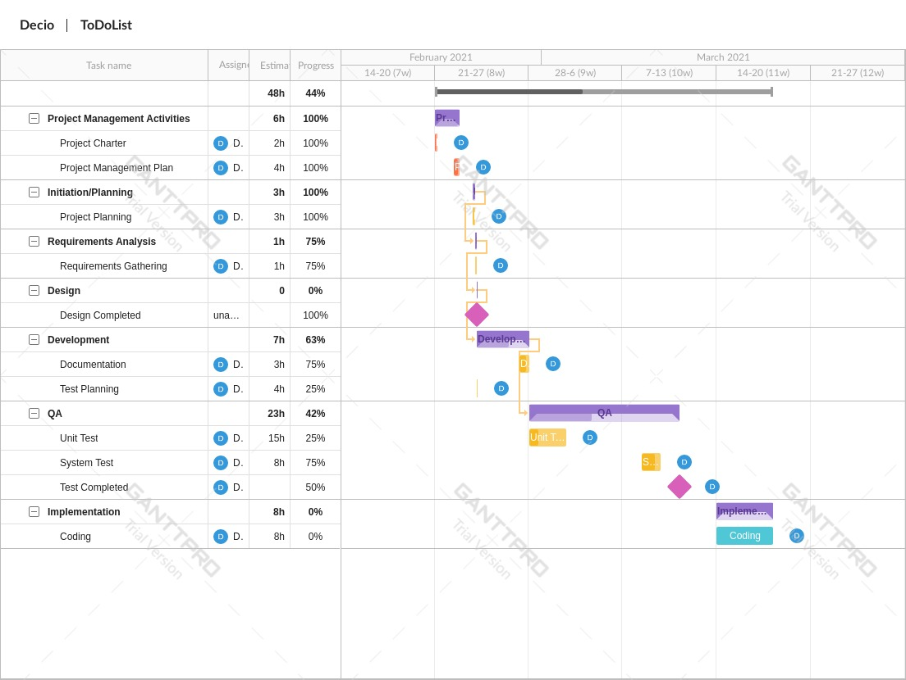
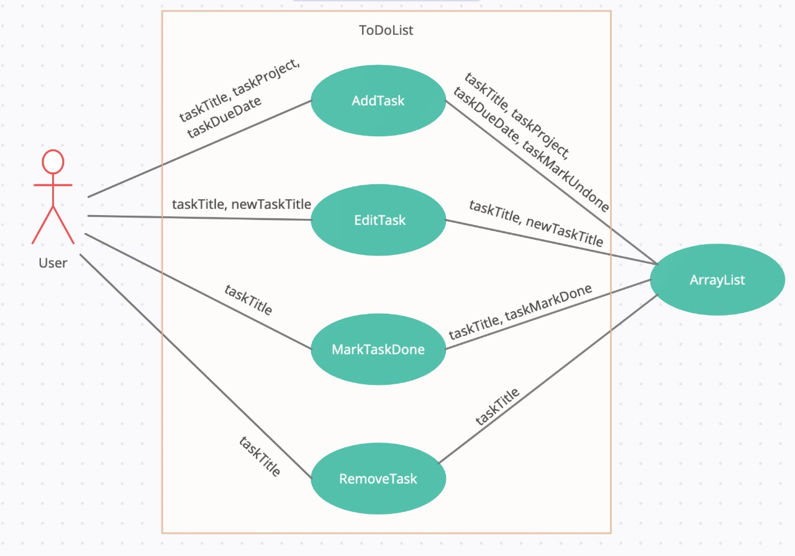

# Decio Candido Individual Project - SDA9

The project has been implemented on Gradle Package

#### Project Structure

There are 4 classes implemented in the project, which are taskInterface, writeFileClass, taskClass and menuClass.

The taskInterface is where we find some abstract methods declared for the task object

The taskClass is where we find the methods to set and get the task fields, such as title, project, status and due date

The menuClass is where we find the methods to add the task into an arraylist, remove task from the array

We start the project from the file mainClass.java

#### Milestone

In the Milestone you should find the tasks took to implement the ToDoList, where we also find the estimated time that should take to completed each task, **REMEMBER** estimated time. We would also find the progress made so far for each task.

The Milestone chart is divided into sessions, they are: project management, project planning, requirements analysis, design, development, QA and implementation

![Milestone chart]

#### Use Case

The Use case diagram illustre the user interaction with the solution, for adding task, editing task, deleting task and mark as completed task

![Use Case UML]

#### Class UML

The Class diagram illustre the interaction between classes within the solution, very helpful for embed solution or even for debugging 

![Class UML]

#### Step by step instructions

These are the instructions used to run and test the solution:

1. Clone the git repository dc_project_sda_
2. open Visual Studio
3. locate the folder (#../dc_project_sda_/app/src/main/java/dc_project_sda_)
4. upload the folder into workspace
5. run App.java found on (#../dc_project_sda_/app/src/main/java/dc_project_sda_)

